<!-- README.md is generated from README.Rmd. Please edit that file -->

## Kick-Off “R Learning Sprint”

### What is this about?

Here is [Jon Schwabisch](https://twitter.com/jschwabish)’s teaser for
the event:

> Do you know how to code in R? Would you like to?  
> Recently, the amazing [Cédric Scherer](https://twitter.com/CedScherer)
> published a [ggplot2 tutorial for R
> beginners](https://cedricscherer.netlify.app/2019/08/05/a-ggplot2-tutorial-for-beautiful-plotting-in-r/).
> If you’ve never tried R, [ggplot2](https://ggplot2.tidyverse.org/) is
> the principal package that many people use to create data
> visualizations.  
> As we wrap up the year, I thought it might be fun and useful to get
> together–virtually, of course–to learn R together and go through
> Cédric’s tutorial step by step. I [learned R by working with my Urban
> Institute colleague Aaron
> Williams](https://medium.com/@urban_institute/learning-r-a-conversation-982130d75104),
> which I found to be the method that worked best for me.  
> So, on Tuesday, December 22, 2020, starting at 10a EST (Washington, DC
> time) and running to about 3p EST (or thereabouts), we’ll meet on Zoom
> to work through Cédric’s examples. Depending on the number of people
> who attend, we may use the breakout room feature to make conversation
> and sharing more manageable.

### Slides

📥 [Download PDF
here](https://raw.githubusercontent.com/Z3tt/Jons_R_Learning_Sprint/main/kick-off.pdf)

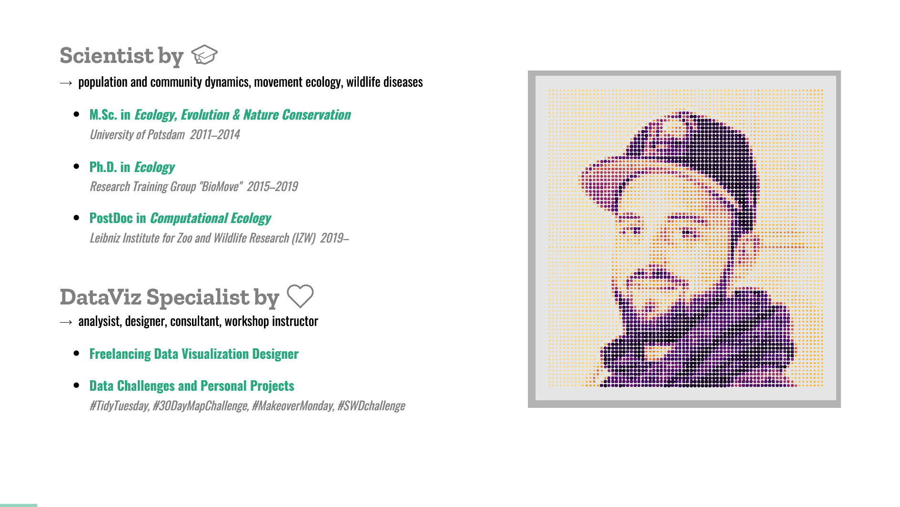 
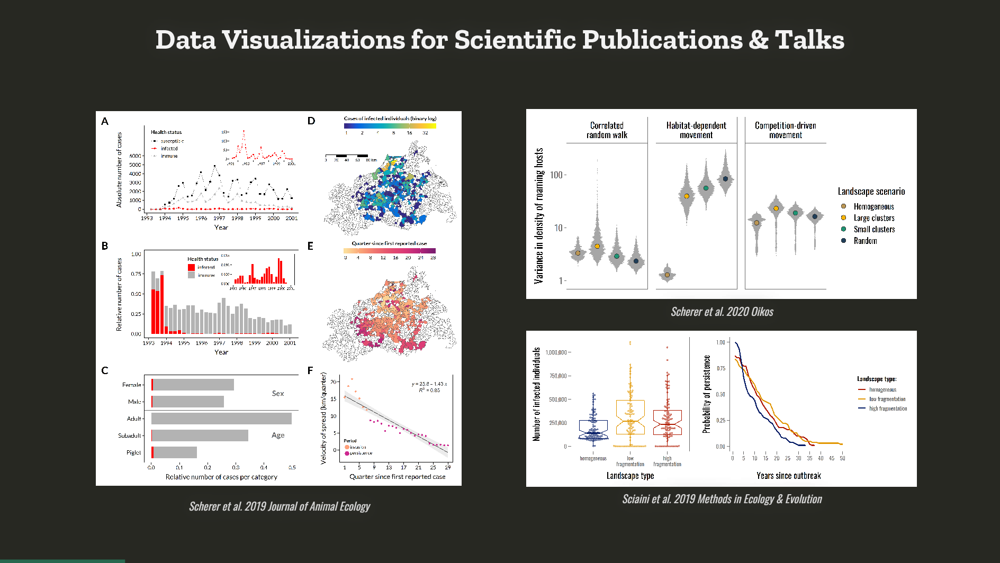 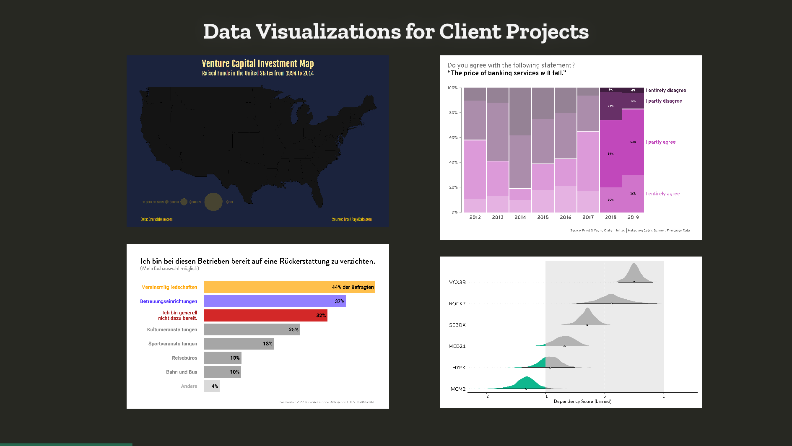
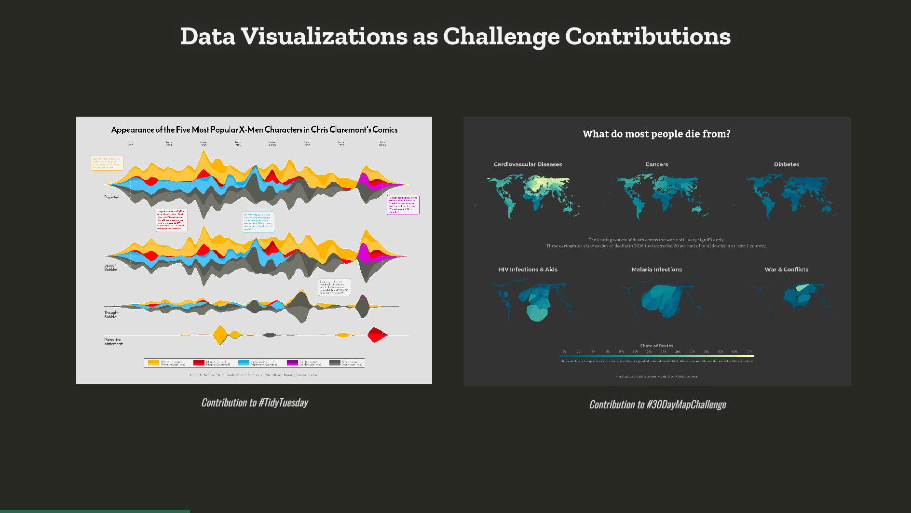 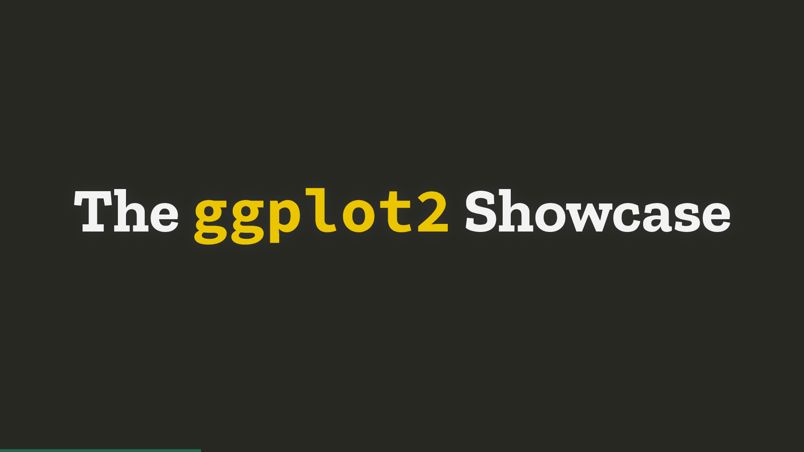
 
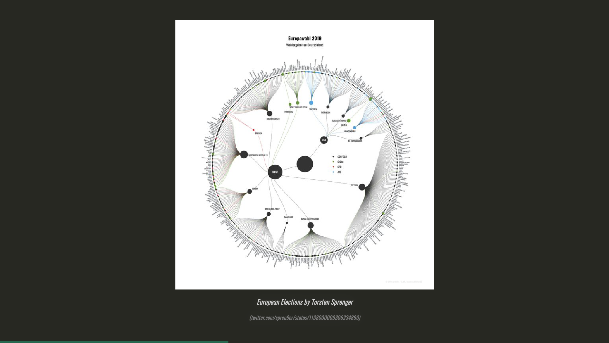 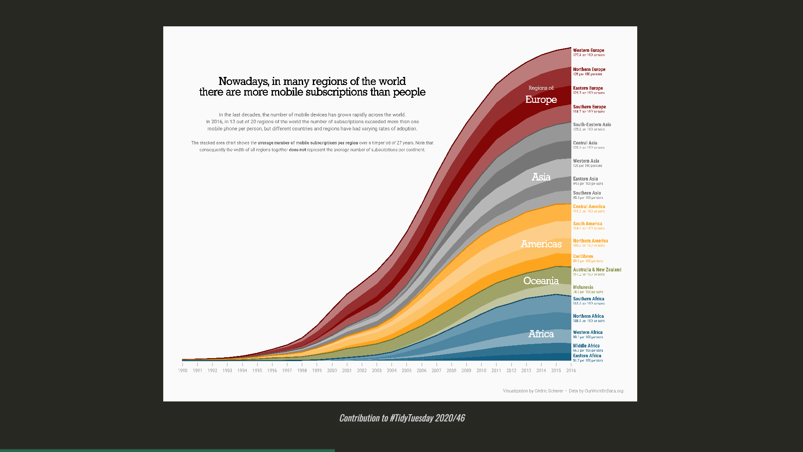
 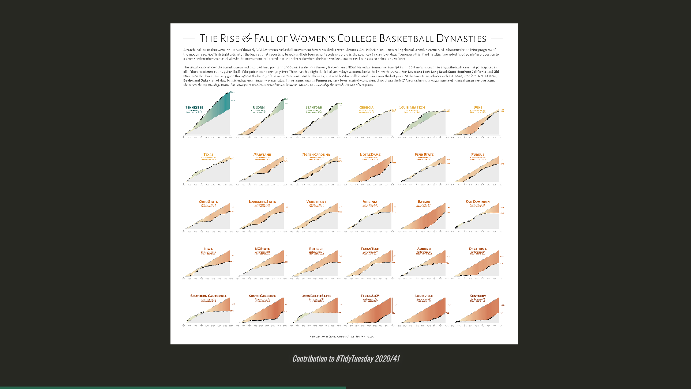
 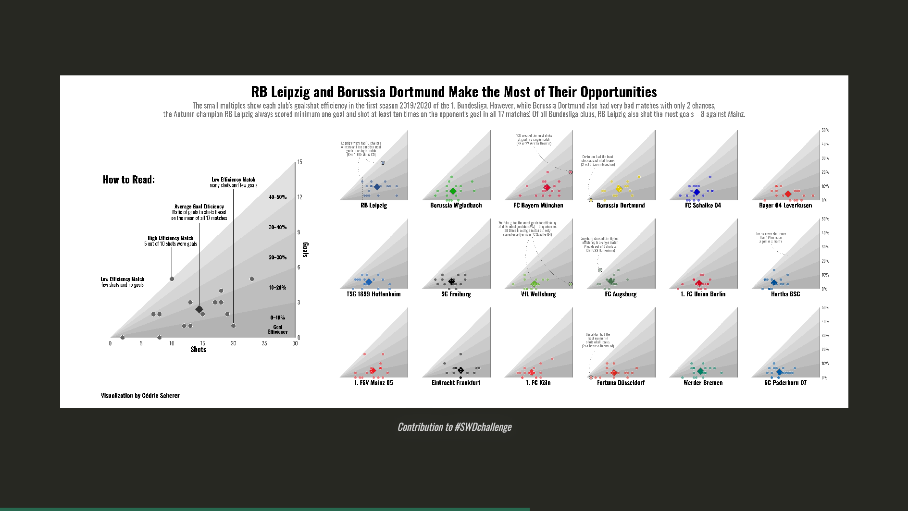
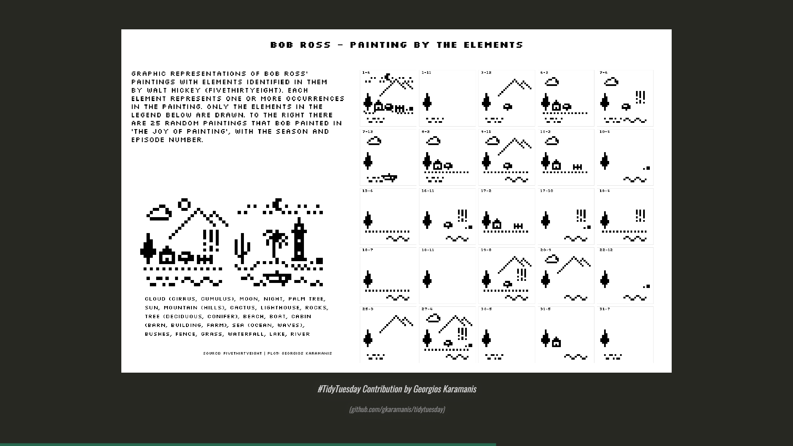 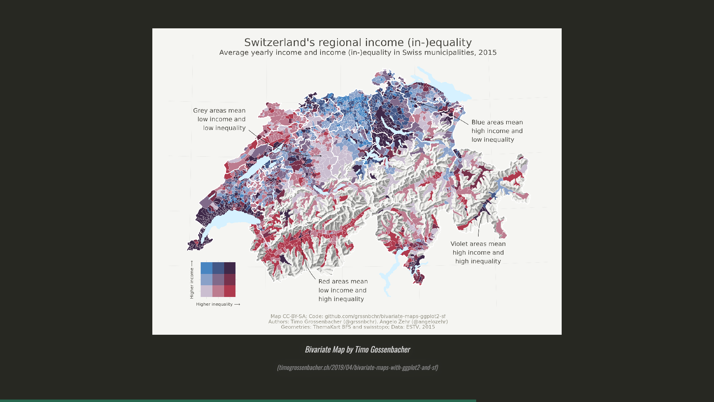
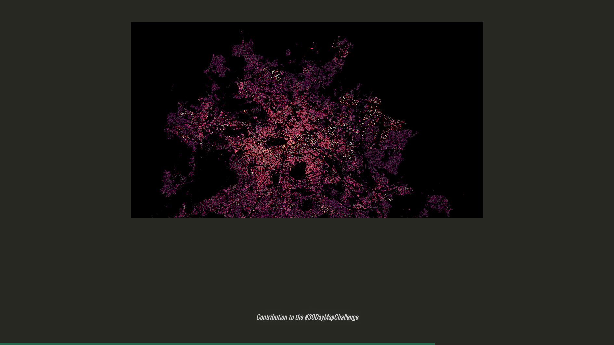 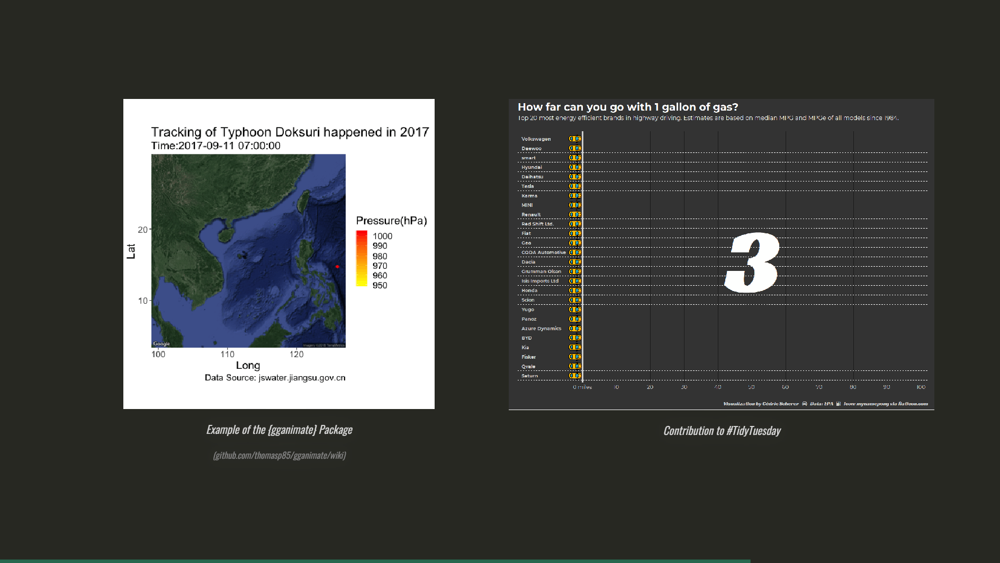
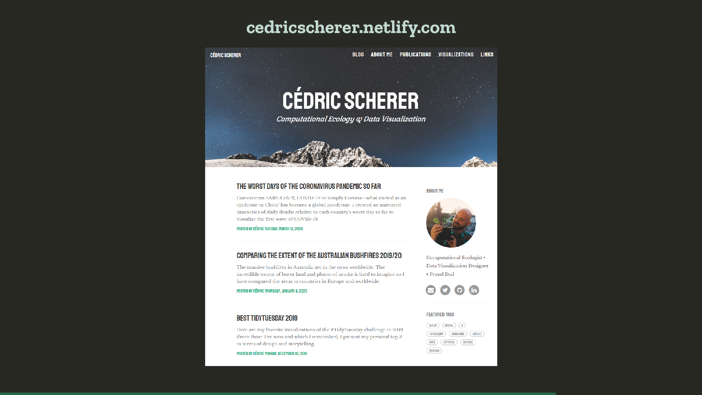 
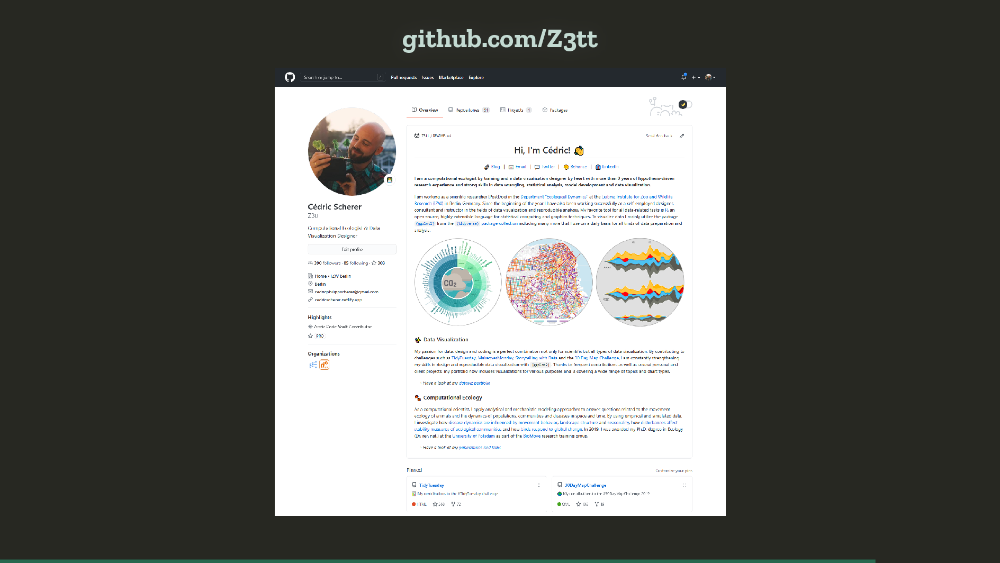 
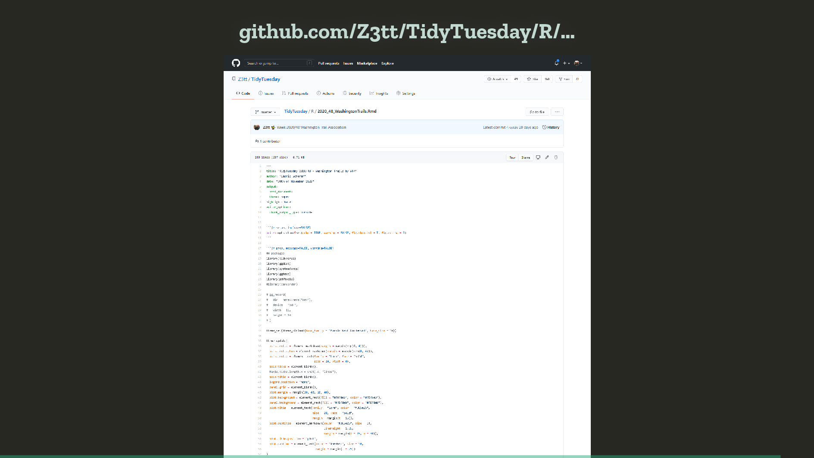 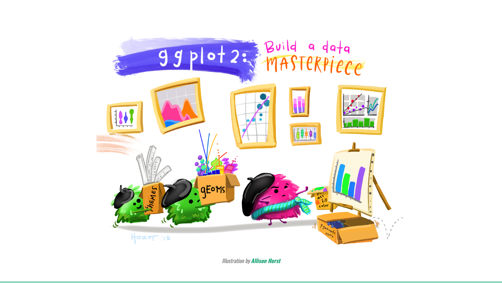
